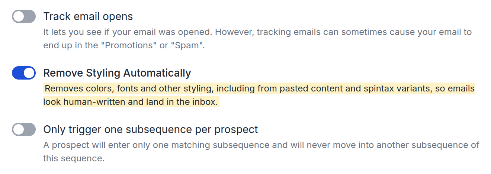
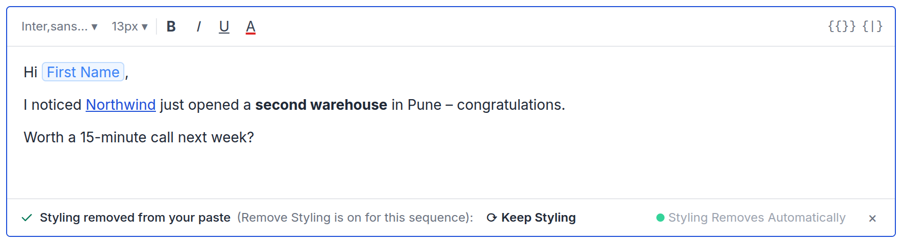
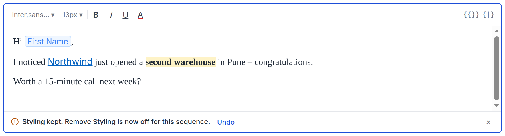
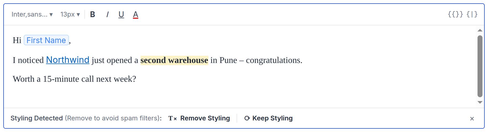
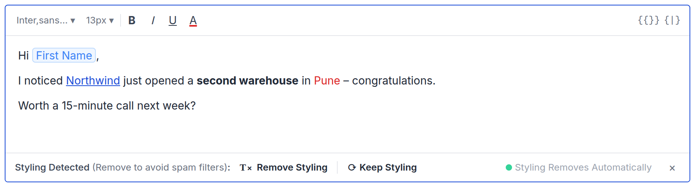
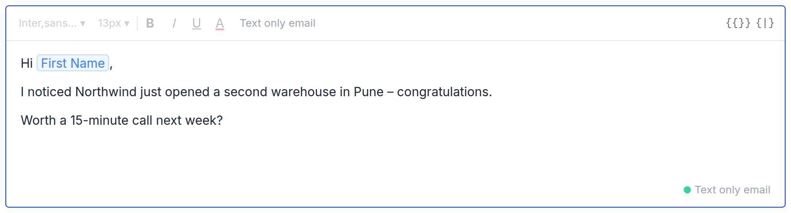
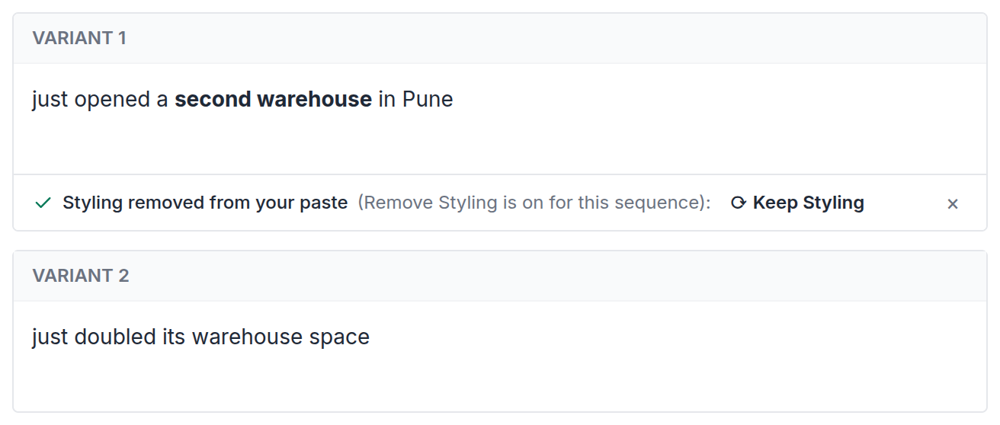
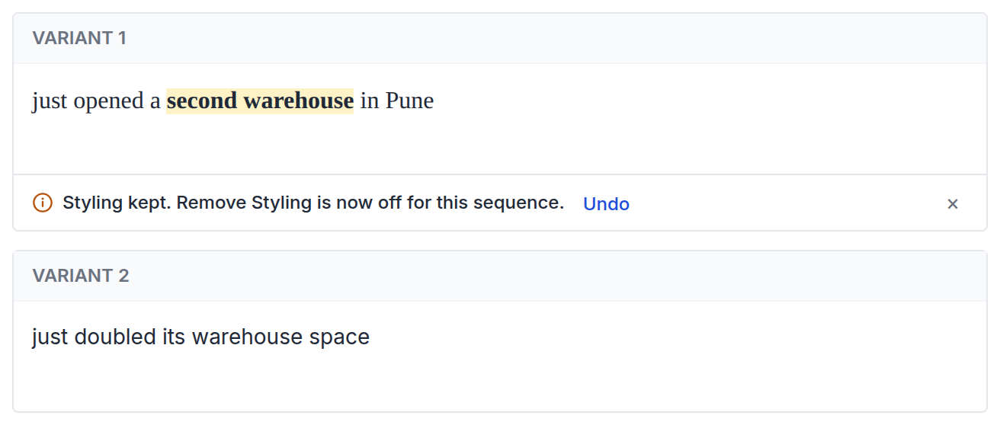

# PRD – Pasting styled content: one rule, Remove Styling

**Design of record:** [prototype](https://product-team-sh.github.io/prd-pasting-styled-content/prototype/) · **Status:** Ready for dev review

These prototype elements are review aids, not product UI:

- the Simulate buttons
- the Remove Styling switcher above the editor and in the spintax header
- the side cards on the Safety Settings tab
- the "Same as the editor" / "Differs from editor" label
- the "How this is handled" notes

---

## 1. Problem

- **Styling from Word goes unnoticed.** Pasted Word content brings fonts, colours, sizes and highlights the writer didn't choose. With Remove Styling on, send strips them, so the editor shows something the prospect never gets.
- **Tokens arrive broken.** Literal `{{First Name}}` or `{spin}…{endspin}` in pasted text can arrive as literal text instead of a chip ([escalation](https://app.basecamp.com/4378325/buckets/16408283/todos/10213661915)).
- **Keep Styling switches the setting off without saying so.** Today, Keep Styling turns Remove Styling off for every email in the sequence, and nothing tells the writer.

## 2. What we're building

1. **Remove Styling Automatically (per sequence) is the only rule for styling**, at paste and at send. There is no new setting.
2. **With Remove Styling on, styling is removed as you paste, and the bar tells you.** Keep Styling brings it back and turns Remove Styling off for the sequence. The bar says so, with Undo.
3. **Literal merge-tag and spintax tokens in a paste become chips.**

---

## 3. Safety Settings (prototype tab 1)

- Replace the Remove Styling Automatically description with: *"Removes colors, fonts and other styling, including from pasted content and spintax variants, so emails look human-written and land in the inbox."*
- Everything else stays as it is.

*The new description, highlighted. Nothing else on the card changes.*

## 4. Email editor (prototype tab 2)

In this section, **"the setting"** means the sequence's Remove Styling Automatically. **Remove Styling** and **Keep Styling** in bold are the bar's buttons.

| The setting | Styled paste | Toolbar styling |
|---|---|---|
| **On** | Lands **without styling**; bar: removed on paste | Stays; bar: Styling Detected |
| **Off** | Lands as is; bar: Styling Detected | Stays; bar: Styling Detected |
| **Text only** | Lands as plain text; no bar | Font, size, colour and B/I/U controls disabled |

**The bar, by state**

| Bar | Copy | Actions |
|---|---|---|
| Removed on paste | *"✓ Styling removed from your paste (Remove Styling is on for this sequence):"* | **Keep Styling** · `×` |
| Styling Detected | *"Styling Detected (Remove to avoid spam filters):"* | **Remove Styling** · **Keep Styling** · `×` |
| After Keep, with the setting on | *"ⓘ Styling kept. Remove Styling is now off for this sequence."* | **Undo** · `×` |

**Screens**

*Setting on, after a Word paste: styling removed as it landed. Bold and the link stay.*

*After "Keep Styling": styling restored, the setting is off, and Undo is offered. The badge is gone because the setting is now off.*

*Setting off, after a Word paste: lands as is, and the Styling Detected bar offers both buttons.*

*Setting on, toolbar colour: the colour stays and the Styling Detected bar asks.*

*Text only: plain text, no bar, styling controls disabled.*

**Actions**

- **Keep Styling, with the setting on:**
    - Keeps the styling, restoring it if it was removed on paste.
    - Turns the setting **off** for the sequence.
    - Shows the "Styling kept" bar. **Undo** removes the styling again and turns the setting back on.
- **Keep Styling, with the setting off:** keeps the styling in this email. The setting is unchanged.
- **Remove Styling:** removes styling from this email. Bold, italic, underline, links and lists stay; fonts, sizes, colours and highlights go. The setting is unchanged.
- **`×`:** closes the bar. On a Styling Detected bar with the setting on, it also removes the styling.

**Also**

- **What counts as text only:** "Send emails as text only" for all emails, or for step 1 when it is set to first email only.
- **The corner badge** ("Styling Removes Automatically" / "Text only email") sits in the bar row, just before `×`, while a bar is showing. Otherwise it stays in the editor's corner.
- **`⌘⇧V` / `Ctrl+Shift+V`** always pastes plain, with no bar.

## 5. Spintax editor (prototype tab 3)

- **Same as §4 inside each variant field:** same bars, same actions, following the sequence's setting.
- **Keep Styling in a variant, with the setting on,** turns the setting off for the whole sequence, body included. The "Styling kept" bar and Undo appear in that variant.
- **Literal tokens pasted into a variant become chips.**

*Setting on, paste into variant 1: the same "removed" bar, inside the variant field.*

*After "Keep Styling" in a variant: the setting turns off for the whole sequence, body included.*

---

## 6. Acceptance criteria

| ID | Case | Expected | P |
|---|---|---|---|
| A1 | Setting **on**: paste Word content with font, colour and highlight | Lands without styling (bold and links stay); bar reads "Styling removed from your paste (Remove Styling is on for this sequence)" with **Keep Styling** | P0 |
| A2 | A1, then **Keep Styling** | Styling restored. **One** `PATCH /sequences/{id}/settings` sets `text-only-email` to `0`; `GET /sequences/{id}/config` confirms it. "Styling kept" bar shows with Undo; badge disappears | **P0, sign off by name. Owner: TBD** |
| A3 | A2, then **Undo** | Styling removed again; `text-only-email` back to `1`; badge returns | P0 |
| A4 | Setting **off**: paste Word content | Lands styled; Styling Detected bar with both buttons | P0 |
| A5 | Setting **off**: **Remove Styling** or **Keep Styling** | Acts on this email only; no settings request | P0 |
| A6 | Setting on or off: apply a text colour from the toolbar | Colour stays; Styling Detected bar with both buttons. **Remove Styling** removes it with no settings request. **Keep Styling** behaves as A2 when the setting is on, and as A5 when it is off | P0 |
| A7 | Text only: paste Word content | Plain; no bar; "Text only email" badge | P0 |
| A8 | Paste plain text | No bar | P0 |
| A9 | Copy and paste within Saleshandy | Chips stay chips; any styling follows A1 or A4 | P0 |
| A10 | Paste literal `{{First Name}}` or `{spin}a\|b{endspin}` | Becomes a chip, in the body and in variants | P0 |
| A11 | `⌘⇧V` in any state | Plain; no bar | P0 |
| A12 | Safety Settings | Remove Styling description reads exactly as in §3; no separate spintax control | P1 |
| A13 | Spintax, setting on: paste into variant 1, then **Keep Styling** | Variant 1 restored; setting off for the sequence; "Styling kept" bar in variant 1 | P0 |
| A14 | Spintax: keep styling in a variant, save, reopen, send a test | The spin still parses and spins; no literal `{spin}` in any output | **P0, release blocker** |

**Open before estimation:** A14 depends on the spin parser tolerating styling inside a variant. An [open bug](https://app.basecamp.com/4378325/buckets/22269754/todos/10258397458) says it does not today. Owner: Rajat.

---

**Related:** [card](https://app.basecamp.com/4378325/buckets/22269754/card_tables/cards/10216633873) · [webui PR #8129](https://github.com/saleshandy/saleshandy-webui/pull/8129) (reuse its paste sanitiser and token-to-chip handling)
