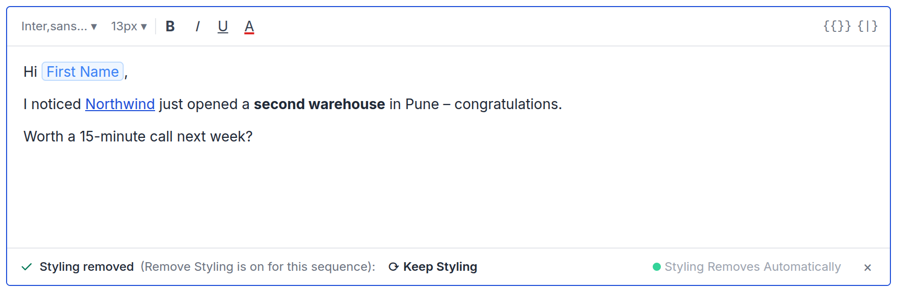
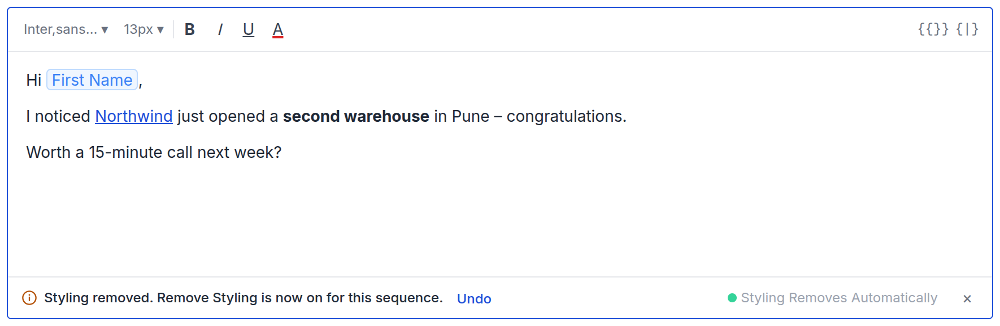

# PRD – Pasting styled content: one rule, Remove Styling

**Design of record:** [prototype](https://product-team-sh.github.io/prd-pasting-styled-content/prototype/) · **Status:** Ready for dev review

These prototype elements are review aids, not product UI:

- the Simulate buttons
- the Remove Styling switcher above the editor and in the spintax header
- the side cards on the Safety Settings tab
- the "Same as the editor" / "Differs from editor" label
- the "How this is handled" notes

---

## 1. Problem

- **Styling from Word goes unnoticed.** Pasted Word content brings fonts, colours, sizes and highlights the writer didn't choose. With Remove Styling on, send strips them, so the editor shows something the prospect never gets.
- **Tokens arrive broken.** Literal `{{First Name}}` or `{spin}…{endspin}` in pasted text can arrive as literal text instead of a chip ([escalation](https://app.basecamp.com/4378325/buckets/16408283/todos/10213661915)).
- **Keep Styling switches the setting off without saying so.** Today, Keep Styling turns Remove Styling off for every email in the sequence, and nothing tells the writer.

## 2. What we're building

1. **Remove Styling Automatically (per sequence) is the only rule for styling**, at paste and at send. There is no new setting.
2. **With Remove Styling on, styling is removed as you paste or apply it, and the bar tells you.** Keep Styling brings it back and turns Remove Styling off for the sequence. The bar says so, with Undo. With the setting off, the bar asks once per sequence, until the writer answers.
3. **Literal merge-tag and spintax tokens in a paste become chips.**

---

## 3. Safety Settings (prototype tab 1)

- Replace the Remove Styling Automatically description with: *"Removes colors, fonts and other styling, including from pasted content and spintax variants, so emails look human-written and land in the inbox."*
- Everything else stays as it is.

*The new description, highlighted. Nothing else on the card changes.*

## 4. Email editor (prototype tab 2)

In this section, **"the setting"** means the sequence's Remove Styling Automatically. **Remove Styling** and **Keep Styling** in bold are the bar's buttons.

| The setting | Styled paste | Toolbar styling |
|---|---|---|
| **On** | Lands **without styling**; bar: styling removed | Removed straight away; bar: styling removed |
| **Off** | Lands as is; bar: Styling Detected, **until the sequence is answered** | Stays; same as paste |
| **Text only** | Lands as plain text; no bar | Font, size, colour and B/I/U controls disabled |

**The bar, by state**

| Bar | Copy | Actions |
|---|---|---|
| Styling removed (setting on) | Paste: *"✓ Styling removed from your paste (Remove Styling is on for this sequence):"* Toolbar: *"✓ Styling removed (Remove Styling is on for this sequence):"* | **Keep Styling** · `×` |
| Styling Detected (setting off, not yet answered) | *"Styling Detected (Remove to avoid spam filters):"* | **Remove Styling** · **Keep Styling** · `×` |
| After Keep, with the setting on | *"ⓘ Styling kept. Remove Styling is now off for this sequence."* | **Undo** · `×` |
| After Remove Styling, with the setting off | *"ⓘ Styling removed. Remove Styling is now on for this sequence."* | **Undo** · `×` |

**Screens**

*Setting on, after a Word paste: styling removed as it landed. Bold and the link stay.*

*After "Keep Styling": styling restored, the setting is off, and Undo is offered. The badge is gone because the setting is now off.*

*Setting off, first styled paste in this sequence: lands as is, and the Styling Detected bar asks.*

*Setting on, toolbar colour: removed straight away, like a paste, with the same bar and Keep Styling.*

*Setting off, after "Remove Styling": this email is cleaned and the setting turns on, with Undo.*

*Text only: plain text, no bar, styling controls disabled.*

**Actions**

- **Keep Styling, with the setting on:**
    - Restores the styling that was removed.
    - Turns the setting **off** for the sequence, and marks the sequence **answered**.
    - Shows the "Styling kept" bar. **Undo** removes the styling again, turns the setting back on, and restores the answered state.
- **Setting off: the bar asks until the writer answers, once per sequence.**
    - **Keep Styling:** keeps the styling and marks the sequence **answered**. The bar never shows again in this sequence, in any step, variant or session.
    - **Remove Styling:** removes styling from this email (bold, italic, underline, links and lists stay) and turns the setting **on**. Shows the "now on" bar. **Undo** restores the styling and turns the setting back off; the sequence stays unanswered.
    - **`×`:** means "not now". The bar closes and the styling stays. The sequence is **not** answered, so the next styled paste or style asks again.
- **`×` on any other bar:** closes the bar. The editor content stays as it is.
- **"Answered" is stored per sequence.** It is not shown in Safety Settings. Turning the setting on, from any path, clears it, so if the setting is later turned off again, writers are asked once more.

**Also**

- **What counts as text only:** "Send emails as text only" for all emails, or for step 1 when it is set to first email only.
- **The corner badge** ("Styling Removes Automatically" / "Text only email") sits in the bar row, just before `×`, while a bar is showing. Otherwise it stays in the editor's corner.
- **When the bar is too narrow** (the editor is about 790px wide today): "(Remove Styling is on for this sequence)" drops first, then the badge shows only its dot. Buttons and `×` never shrink or wrap.
- **`⌘⇧V` / `Ctrl+Shift+V`** always pastes plain, with no bar.

## 5. Spintax editor (prototype tab 3)

- **Same as §4 inside each variant field:** same bars, same actions, following the sequence's setting. Variants share the sequence's answered state with the email body.
- **Keep Styling in a variant, with the setting on,** turns the setting off for the whole sequence, body included. The "Styling kept" bar and Undo appear in that variant.
- **Literal tokens pasted into a variant become chips.**

*Setting on, paste into variant 1: the same "removed" bar, inside the variant field.*

*After "Keep Styling" in a variant: the setting turns off for the whole sequence, body included.*

---

## 6. Acceptance criteria

| ID | Case | Expected | P |
|---|---|---|---|
| A1 | Setting **on**: paste Word content with font, colour and highlight | Lands without styling (bold and links stay); bar reads "Styling removed from your paste (Remove Styling is on for this sequence)" with **Keep Styling** | P0 |
| A2 | A1, then **Keep Styling** | Styling restored. **One** `PATCH /sequences/{id}/settings` sets `text-only-email` to `0`; `GET /sequences/{id}/config` confirms it. Sequence marked answered. "Styling kept" bar shows with Undo; badge disappears | **P0, sign off by name. Owner: TBD** |
| A3 | A2, then **Undo** | Styling removed again; `text-only-email` back to `1`; answered state restored; badge returns | P0 |
| A4 | Setting **off**, sequence not answered: paste Word content | Lands styled; Styling Detected bar with both buttons | P0 |
| A5 | A4, then **Keep Styling** | Bar closes, styling stays, no change to `text-only-email`. Sequence marked answered, and the answered state reads back from `GET /sequences/{id}/config` | P0 |
| A6 | Setting off, sequence answered: paste or style in another step, in a variant, and after reopening the editor | No bar anywhere; styling stays | P0 |
| A7 | A4, then **`×`**, then a new styled paste or toolbar style | Bar closes, styling stays, no request. The next styled paste or style shows the bar again | P0 |
| A8 | A4, then **Remove Styling** | Styling removed from this email. **One** `PATCH` sets `text-only-email` to `1`. "Styling removed. Remove Styling is now on" bar with Undo; badge appears | P0 |
| A9 | A8, then **Undo** | Styling back; `text-only-email` back to `0`; sequence still unanswered, so the next styled paste asks | P0 |
| A10 | Setting **on**: apply a text colour from the toolbar | Colour removed straight away; bar reads "Styling removed (Remove Styling is on for this sequence)" with **Keep Styling**, which restores the colour and behaves as A2 | P0 |
| A11 | Setting off and answered; turn it on in Safety Settings, then off again | The first styled paste asks again | P1 |
| A12 | Text only: paste Word content | Plain; no bar; "Text only email" badge | P0 |
| A13 | Paste plain text | No bar | P0 |
| A14 | Copy and paste within Saleshandy | Chips stay chips; any styling follows A1, A4 or A6 | P0 |
| A15 | Paste literal `{{First Name}}` or `{spin}a\|b{endspin}` | Becomes a chip, in the body and in variants | P0 |
| A16 | `⌘⇧V` in any state | Plain; no bar | P0 |
| A17 | Safety Settings | Remove Styling description reads exactly as in §3; no separate spintax control | P1 |
| A18 | Spintax, setting on: paste into variant 1, then **Keep Styling** | Variant 1 restored; setting off for the sequence; "Styling kept" bar in variant 1 | P0 |
| A19 | Spintax, setting off: **Keep Styling** in a variant, then paste styled content into the email body | No bar in the body; answered is shared across the sequence | P0 |
| A20 | Spintax: keep styling in a variant, save, reopen, send a test | The spin still parses and spins; no literal `{spin}` in any output | **P0, release blocker** |

**Open before estimation:** A20 depends on the spin parser tolerating styling inside a variant. An [open bug](https://app.basecamp.com/4378325/buckets/22269754/todos/10258397458) says it does not today. Owner: Rajat.

---

**Related:** [card](https://app.basecamp.com/4378325/buckets/22269754/card_tables/cards/10216633873) · [webui PR #8129](https://github.com/saleshandy/saleshandy-webui/pull/8129) (reuse its paste sanitiser and token-to-chip handling)
